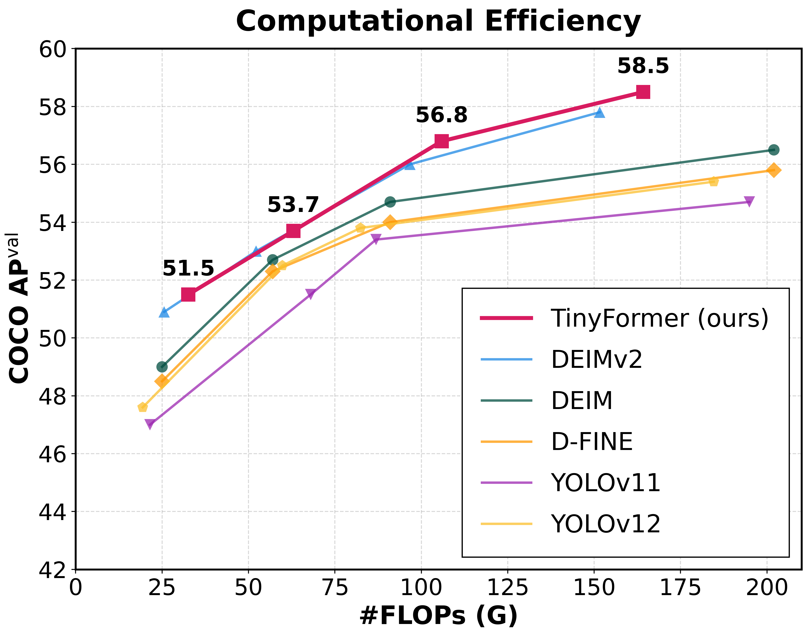
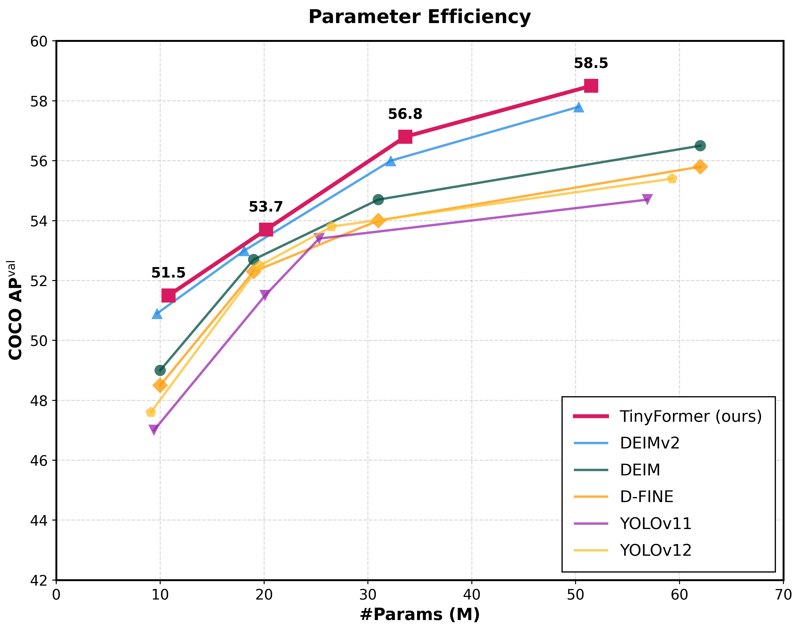
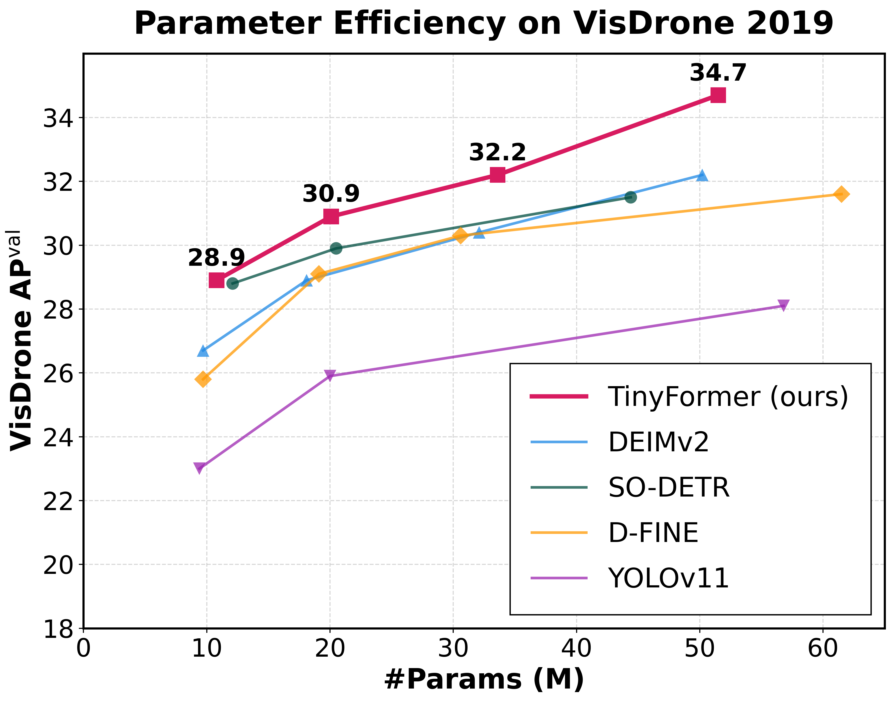

<h2 align="center">
  TinyFormer-Preserving-Tiny-Objects-in-YOLO-style-Detectors
</h2>

<!-- <p align="center">
    <a href="https://github.com/Intellindust-AI-Lab/DEIMv2/blob/master/LICENSE">
        
    </a>
    <a href="https://arxiv.org/abs/2509.20787">
        
    </a>
   <a href="https://intellindust-ai-lab.github.io/projects/DEIMv2/">
        
    </a>
    <a href="https://github.com/Intellindust-AI-Lab/DEIMv2/pulls">
        
    </a>
    <a href="https://github.com/Intellindust-AI-Lab/DEIMv2/issues">
        
    </a>
    <a href="https://github.com/Intellindust-AI-Lab/DEIMv2">
        
    </a>
    <a href="mailto:shenxi@intellindust.com">
        
    </a>
</p> -->

<p align="center">
    TinyFormer is a high-performance real-time object detector that bridges the gap between YOLO-style efficiency and DETR-based precision. By introducing the Parallel Bi-fusion Module (PBM) and Spatial Semantic Adapter (SSA), it effectively preserves fine-grained spatial information, achieving State-of-the-Art performance in tiny object detection without compromising inference speed.
</p>

---


<div align="center">

  
  <a href="https://scholar.google.com/citations?user=mXUOEzwAAAAJ&hl=zh-TW">Jun-Wei Hsieh</a><sup>1*</sup>,&nbsp;&nbsp;
  Meng-Yu Kao<sup>1</sup>,&nbsp;&nbsp;
  <a href="https://scholar.google.com.tw/citations?user=rp-3vOYAAAAJ&hl=zh-TW&oi=sra">Ghufron Wahyu Kurniawan</a><sup>1</sup>,&nbsp;&nbsp;
  <a href="https://scholar.google.com.tw/citations?user=GBi3LYkAAAAJ&hl=zh-TW&oi=sra">Kuan-Chuan Peng</a><sup>2</sup>
  

  
  <sup>1</sup>College of Artificial Intelligence, National Yang Ming Chiao Tung University, Taiwan<br>
  <sup>2</sup>Mitsubishi Electric Research Laboratories
  

  <small><sup>*</sup>Corresponding author</small>
</div>

  
<p align="center">
<i>
institution
</i>
</p>


<p align="center">
  
</p>

</details>

 
  
##  Updates

  
  
## 1. Model Zoo
### COCO


| Model | Dataset | AP | #Params | GFLOPs | Latency(ms) | config | checkpoint |
| :---: | :---: | :---: | :---: | :---: |:------------:| :---: | :---: | 
| **TinyFomer-S-PBM** | COCO | **51.5** | 10.8M | 32.6 | 2.36  | [yml](./configs/tinyformer/tinyformer_dinov3_s_coco_pbm.yml) | [Link](http://140.113.110.150:5000/sharing/AhP1PzOpi) |
| **TinyFomer-M-PBM** | COCO | **53.7** | 20.2M | 63.0  | 3.22 | [yml](./configs/tinyformer/tinyformer_dinov3_m_coco_pbm.yml) | [Link](http://140.113.110.150:5000/sharing/rkowjjp56) |
| **TinyFomer-L-PBM** | COCO | **56.8** | 33.6M | 105.9  | 3.72 | [yml](./configs/tinyformer/tinyformer_dinov3_l_coco_pbm.yml) | [Link](http://140.113.110.150:5000/sharing/wjVPvDtCK) |
| **TinyFomer-X-PBM** | COCO | **58.5** | 51.5M | 164.2  | 4.81 | [yml](./configs/tinyformer/tinyformer_dinov3_x_coco_pbm.yml) | [Link](http://140.113.110.150:5000/sharing/5F4yhersA) |
| **TinyFomer-XL-PBM** | COCO | **60.6** | 125.5M | 437.9 |  7.91   | [yml](./configs/tinyformer/tinyformer_dinov3_xl_coco_pbm.yml) | [Link](http://140.113.110.150:5000/sharing/Qzyz1aAkG) |


<details>
<summary><h3><strong>  Models without PBM</strong></h3></summary>
  
| Model | Dataset | AP | #Params | GFLOPs | Latency(ms) | config | checkpoint |
| :---: | :---: | :---: | :---: | :---: |:------------:| :---: | :---: | 
| **TinyFomer-S** | COCO | **51.3** | 9.8M |  25.1 | 2.33  | [yml](./configs/tinyformer/tinyformer_dinov3_s_coco.yml) | [Link](http://140.113.110.150:5000/sharing/8cAsmrEye) |
| **TinyFomer-M** | COCO | **53.5** | 18.2M | 51.2 | 3.05 | [yml](./configs/tinyformer/tinyformer_dinov3_m_coco.yml) | [Link](http://140.113.110.150:5000/sharing/WEI4Aoxsu) |
| **TinyFomer-L** | COCO | **56.5** | 32.3M | 96.3  |  3.54 | [yml](./configs/tinyformer/tinyformer_dinov3_l_coco.yml) | [Link](http://140.113.110.150:5000/sharing/NZiKRBghP) |
| **TinyFomer-X** | COCO | **58.4** | 49.8M | 151.1 |  4.63  | [yml](./configs/tinyformer/tinyformer_dinov3_x_coco.yml) | [Link](http://140.113.110.150:5000/sharing/gHCL5pOSk) |

</details>


### VisDrone 2019


| Model | Dataset | AP | #Params | GFLOPs | config | checkpoint |
| :---: | :---: | :---: | :---: | :---: | :---: | :---: | 
| **TinyFomer-S-PBM-visdrone** | VisDrone | **28.9** | 10.8M | 32.6 |  [yml](./configs/tinyformer/visdrone/tinyformer_dinov3_s_coco_pbm_visdrone.yml) | [Link](http://140.113.110.150:5000/sharing/tNijI5DdW) |
| **TinyFomer-M-PBM-visdrone** | VisDrone | **30.9** | 20.1M | 63.0  | [yml](./configs/tinyformer/visdrone/tinyformer_dinov3_m_coco_pbm_visdrone.yml) | [Link](http://140.113.110.150:5000/sharing/umWSr3NgG) |
| **TinyFomer-L-PBM-visdrone** | VisDrone | **32.2** | 33.6M | 105.6  | [yml](./configs/tinyformer/visdrone/tinyformer_dinov3_l_coco_pbm_visdrone.yml) | [Link](http://140.113.110.150:5000/sharing/ejcGqF2IH) |
| **TinyFomer-X-PBM-visdrone** | VisDrone | **34.7** | 51.5M | 163.9  |  [yml](./configs/tinyformer/visdrone/tinyformer_dinov3_x_coco_pbm_visdrone.yml) | [Link](http://140.113.110.150:5000/sharing/XdcqUT7Xz) |


### Object365+COCO
| Model | Dataset | AP | #Params | GFLOPs | Latency(ms)  | config | checkpoint |
| :---: | :---: | :---: | :---: | :---: |:------------:| :---: | :---: | 
| **TinyFomer-X-PBM** | Object365+COCO | **60.2** | 51.5M | 164.2 | 4.81    | [yml](./configs/tinyformer/object365/tinyformer_dinov3_x_obj2coco_pbm_24e.yml) | [Link](http://140.113.110.150:5000/sharing/e9fen8f9g) |
| **TinyFomer-XL-PBM** | Object365+COCO | **62.5** | 125.5M | 437.9   |  7.91    | [yml](./configs/tinyformer/object365/tinyformer_dinov3_xl_obj2coco_pbm_24e.yml) | [Link](http://140.113.110.150:5000/sharing/mvSVFwJZe) |

**Notes:**
- **AP(AP<sup>val</sup>)** is evaluated on *MSCOCO val2017* dataset.
- **Latency** is evaluated on a single 3090 GPU with $batch\\_size = 1$, $fp16$, and $TensorRT==10.14.18$.
- **Objects365+COCO** means finetuned model on *COCO* using pretrained weights trained on *Objects365*.


<details>
<summary><h3><strong>  Pretrained Models on Objects365 (Best generalization) </strong></h3></summary>
  
| Model | Dataset | AP<sup>5000</sup> | #Params | GFLOPs | Latency(ms)  | config | checkpoint |
| :---: | :---: | :---: | :---: | :---: |:------------:| :---: | :---: | 
| **TinyFomer-X-PBM** | Object365 | **47.0** | 51.5M | 164.2  | 4.81   | [yml](./configs/tinyformer/object365/tinyformer_dinov3_x_obj365_pbm.yml) | [Link](http://140.113.110.150:5000/sharing/ECP1QyyWz) |
| **TinyFomer-XL-PBM** | Object365 | **52.4** | 125.5M | 437.9  |  7.91    | [yml](./configs/tinyformer/object365/tinyformer_dinov3_xl_obj365_pbm.yml) | [Link](http://140.113.110.150:5000/sharing/itlmEtOof)|


- **AP<sup>5000</sup>** is evaluated on the first 5000 samples of the *Objects365* validation set.

</details>

## 2. Quick start

### Setup

```shell
conda create -n tinyformer python=3.11 -y
conda activate tinyformer
pip install -r requirements.txt
```


### Data Preparation

<details>
<summary> COCO2017 Dataset </summary>

1. Download COCO2017 from [OpenDataLab](https://opendatalab.com/OpenDataLab/COCO_2017) or [COCO](https://cocodataset.org/#download).
2. Modify paths in [coco_detection.yml](./configs/dataset/coco_detection.yml)

    ```yaml
    train_dataloader:
        img_folder: /data/COCO2017/train2017/
        ann_file: /data/COCO2017/annotations/instances_train2017.json
    val_dataloader:
        img_folder: /data/COCO2017/val2017/
        ann_file: /data/COCO2017/annotations/instances_val2017.json
    ```

</details>

<details>
<summary> VisDrone 2019 Dataset </summary>

1. Download dataset from [VisDrone-Dataset](https://github.com/VisDrone/VisDrone-Dataset).
2. Modify `TXT_FOLDER`, `IMG_FOLDER`, and `OUTPUT_JSON` in [tools/dataset/visdrone2coco.py](./tools/dataset/visdrone2coco.py) to match your local paths, then run the script:

   ```shell
   # Run the conversion script
   python tools/dataset/visdrone2coco.py
   ```

4. Modify paths in [vis_drone.yml](./configs/dataset/vis_drone.yml)

    ```yaml
    train_dataloader:
        img_folder: ./datasets/VisDrone/train/
        ann_file: ./datasets/VisDrone/annotations/train.json
    val_dataloader:
        img_folder: ./datasets/VisDrone/val/
        ann_file: ./datasets/VisDrone/annotations/val.json
    ```

</details>


<details>
<summary> Objects365 Dataset </summary>

1. Download Objects365 from [OpenDataLab](https://opendatalab.com/OpenDataLab/Objects365).

2. Set the Base Directory:
```shell
export BASE_DIR=/data/Objects365/data
```

3. Extract and organize the downloaded files, resulting directory structure:

```shell
${BASE_DIR}/train
├── images
│   ├── v1
│   │   ├── patch0
│   │   │   ├── 000000000.jpg
│   │   │   ├── 000000001.jpg
│   │   │   └── ... (more images)
│   ├── v2
│   │   ├── patchx
│   │   │   ├── 000000000.jpg
│   │   │   ├── 000000001.jpg
│   │   │   └── ... (more images)
├── zhiyuan_objv2_train.json
```

```shell
${BASE_DIR}/val
├── images
│   ├── v1
│   │   ├── patch0
│   │   │   ├── 000000000.jpg
│   │   │   └── ... (more images)
│   ├── v2
│   │   ├── patchx
│   │   │   ├── 000000000.jpg
│   │   │   └── ... (more images)
├── zhiyuan_objv2_val.json
```

4. Create a New Directory to Store Images from the Validation Set:
```shell
mkdir -p ${BASE_DIR}/train/images_from_val
```

5. Copy the v1 and v2 folders from the val directory into the train/images_from_val directory
```shell
cp -r ${BASE_DIR}/val/images/v1 ${BASE_DIR}/train/images_from_val/
cp -r ${BASE_DIR}/val/images/v2 ${BASE_DIR}/train/images_from_val/
```

6. Run remap_obj365.py to merge a subset of the validation set into the training set. Specifically, this script moves samples with indices between 5000 and 800000 from the validation set to the training set.
```shell
python tools/remap_obj365.py --base_dir ${BASE_DIR}
```


7. Run the resize_obj365.py script to resize any images in the dataset where the maximum edge length exceeds 640 pixels. Use the updated JSON file generated in Step 5 to process the sample data. Ensure that you resize images in both the train and val datasets to maintain consistency.
```shell
python tools/resize_obj365.py --base_dir ${BASE_DIR}
```

8. Modify paths in [obj365_detection.yml](./configs/dataset/obj365_detection.yml)

    ```yaml
    train_dataloader:
        img_folder: /data/Objects365/data/train
        ann_file: /data/Objects365/data/train/new_zhiyuan_objv2_train_resized.json
    val_dataloader:
        img_folder: /data/Objects365/data/val/
        ann_file: /data/Objects365/data/val/new_zhiyuan_objv2_val_resized.json
    ```


</details>

<details>
<summary>Custom Dataset</summary>

To train on your custom dataset, you need to organize it in the COCO format. Follow the steps below to prepare your dataset:

1. **Set `remap_mscoco_category` to `False`:**

    This prevents the automatic remapping of category IDs to match the MSCOCO categories.

    ```yaml
    remap_mscoco_category: False
    ```

2. **Organize Images:**

    Structure your dataset directories as follows:

    ```shell
    dataset/
    ├── images/
    │   ├── train/
    │   │   ├── image1.jpg
    │   │   ├── image2.jpg
    │   │   └── ...
    │   ├── val/
    │   │   ├── image1.jpg
    │   │   ├── image2.jpg
    │   │   └── ...
    └── annotations/
        ├── instances_train.json
        ├── instances_val.json
        └── ...
    ```

    - **`images/train/`**: Contains all training images.
    - **`images/val/`**: Contains all validation images.
    - **`annotations/`**: Contains COCO-formatted annotation files.

3. **Convert Annotations to COCO Format:**

    If your annotations are not already in COCO format, you'll need to convert them. You can use the following Python script as a reference or utilize existing tools:

    ```python
    import json

    def convert_to_coco(input_annotations, output_annotations):
        # Implement conversion logic here
        pass

    if __name__ == "__main__":
        convert_to_coco('path/to/your_annotations.json', 'dataset/annotations/instances_train.json')
    ```

4. **Update Configuration Files:**

    Modify your [custom_detection.yml](./configs/dataset/custom_detection.yml).

    ```yaml
    task: detection

    evaluator:
      type: CocoEvaluator
      iou_types: ['bbox', ]

    num_classes: 777 # your dataset classes
    remap_mscoco_category: False

    train_dataloader:
      type: DataLoader
      dataset:
        type: CocoDetection
        img_folder: /data/yourdataset/train
        ann_file: /data/yourdataset/train/train.json
        return_masks: False
        transforms:
          type: Compose
          ops: ~
      shuffle: True
      num_workers: 4
      drop_last: True
      collate_fn:
        type: BatchImageCollateFunction

    val_dataloader:
      type: DataLoader
      dataset:
        type: CocoDetection
        img_folder: /data/yourdataset/val
        ann_file: /data/yourdataset/val/ann.json
        return_masks: False
        transforms:
          type: Compose
          ops: ~
      shuffle: False
      num_workers: 4
      drop_last: False
      collate_fn:
        type: BatchImageCollateFunction
    ```

</details>

### Backbone Checkpoints

For DINOv3 S and S+, download them following the guide in https://github.com/facebookresearch/dinov3 

For ViT-Tiny and ViT-Tiny+, you can download them from [ViT-Tiny](https://drive.google.com/file/d/1YMTq_woOLjAcZnHSYNTsNg7f0ahj5LPs/view?usp=sharing) and [ViT-Tiny+](https://drive.google.com/file/d/1COHfjzq5KfnEaXTluVGEOMdhpuVcG6Jt/view?usp=sharing) distilled by [DEIMv2](https://github.com/Intellindust-AI-Lab/DEIMv2) team.

Then place them into ./ckpts as:

```shell
ckpts/
├── dinov3_vits16.pth
├── vitt_distill.pt
├── vittplus_distill.pt
└── ...
```


## 3. Usage


<details open>
<summary> COCO2017 </summary>

1. Training
```shell

CUDA_VISIBLE_DEVICES=0,1,2,3 torchrun --master_port=7777 --nproc_per_node=4 train.py -c configs/tinyformer/tinyformer_dinov3_${model}_coco.yml --use-amp --seed=0

CUDA_VISIBLE_DEVICES=0,1,2,3 torchrun --master_port=7777 --nproc_per_node=4 train.py -c configs/tinyformer/tinyformer_dinov3_${model}_coco_pbm.yml --use-amp --seed=0
```

<!-- <summary>2. Testing </summary> -->
2. Testing
```shell

CUDA_VISIBLE_DEVICES=0,1,2,3 torchrun --master_port=7777 --nproc_per_node=4 train.py -c configs/tinyformer/tinyformer_dinov3_${model}_coco.yml --test-only -r model.pth

CUDA_VISIBLE_DEVICES=0,1,2,3 torchrun --master_port=7777 --nproc_per_node=4 train.py -c configs/tinyformer/tinyformer_dinov3_${model}_coco_pbm.yml --test-only -r model.pth

```

<!-- <summary>3. Tuning </summary> -->
3. Tuning
```shell

CUDA_VISIBLE_DEVICES=0,1,2,3 torchrun --master_port=7777 --nproc_per_node=4 train.py -c configs/tinyformer/tinyformer_dinov3_${model}_coco.yml --use-amp --seed=0 -t model.pth

CUDA_VISIBLE_DEVICES=0,1,2,3 torchrun --master_port=7777 --nproc_per_node=4 train.py -c configs/tinyformer/tinyformer_dinov3_${model}_coco_pbm.yml --use-amp --seed=0 -t model.pth
```
</details>

<details open>
<summary> VisDrone 2019 </summary>

1. Training: For VisDrone dataset, please download our COCO chekcpooint as initial weight.
```shell


CUDA_VISIBLE_DEVICES=0,1,2,3 torchrun --master_port=7777 --nproc_per_node=4 train.py -c configs/tinyformer/visdrone/tinyformer_dinov3_${model}_coco_pbm_visdrone.yml --use-amp --seed=0 -t TinyFormer-${model}-pbm-visdrone.pth
```

<!-- <summary>2. Testing </summary> -->
2. Testing
```shell


CUDA_VISIBLE_DEVICES=0,1,2,3 torchrun --master_port=7777 --nproc_per_node=4 train.py -c configs/tinyformer/visdrone/tinyformer_dinov3_${model}_coco_pbm_visdrone.yml --test-only -r TinyFormer-${model}-pbm-visdrone.pth

```


</details>


## 4. Tools
<details>
<summary> Deployment </summary>

<!-- <summary>4. Export onnx </summary> -->
1. Setup
```shell
pip install onnx onnxsim
```

2. Export onnx
```shell
python tools/deployment/export_onnx.py --check -c configs/tinyformer/tinyformer_dinov3_${model}_coco.yml -r model.pth
```

3. Export [tensorrt](https://docs.nvidia.com/deeplearning/tensorrt/install-guide/index.html)
```shell
trtexec --onnx="model.onnx" --saveEngine="model.engine" --fp16
```

</details>

<details>
<summary> Inference (Visualization) </summary>


1. Setup
```shell
pip install -r tools/inference/requirements.txt
```


<!-- <summary>5. Inference </summary> -->
2. Inference (onnxruntime / tensorrt / torch)

Inference on images and videos is now supported.
```shell
python tools/inference/onnx_inf.py --onnx model.onnx --input image.jpg  # video.mp4
python tools/inference/trt_inf.py --trt model.engine --input image.jpg
python tools/inference/torch_inf.py -c configs/tinyformer/tinyformer_dinov3_${model}_coco.yml -r model.pth --input image.jpg --device cuda:0
```
</details>

<details>
<summary> Benchmark </summary>

1. Setup
```shell
pip install -r tools/benchmark/requirements.txt
```

<!-- <summary>6. Benchmark </summary> -->
2. Model FLOPs, MACs, and Params
```shell
python tools/benchmark/get_info.py -c configs/tinyformer/tinyformer_dinov3_${model}_coco.yml
```

2. TensorRT Latency
```shell
python tools/benchmark/trt_benchmark.py --COCO_dir path/to/COCO2017 --engine_dir model.engine
```
</details>

<details>
<summary> Fiftyone Visualization  </summary>

1. Setup
```shell
pip install fiftyone
```
4. Voxel51 Fiftyone Visualization ([fiftyone](https://github.com/voxel51/fiftyone))
```shell
python tools/visualization/fiftyone_vis.py -c configs/tinyformer/tinyformer_dinov3_${model}_coco.yml -r model.pth
```
</details>

<details>
<summary> Others </summary>

1. Auto Resume Training
```shell
bash reference/safe_training.sh
```

2. Converting Model Weights
```shell
python reference/convert_weight.py model.pth
```
</details>


## 5. Citation
If you use `TinFormer` or its methods in your work, please cite the following BibTeX entries:
<details open>
<summary> bibtex </summary>

```latex

  
```
</details>

## 6. Acknowledgement
Our work is built upon [DEIMv2](https://github.com/Intellindust-AI-Lab/DEIMv2),[D-FINE](https://github.com/Peterande/D-FINE), [RT-DETR](https://github.com/lyuwenyu/RT-DETR), [DEIM](https://github.com/ShihuaHuang95/DEIM), and [DINOv3](https://github.com/facebookresearch/dinov3). Thanks for their great work!


